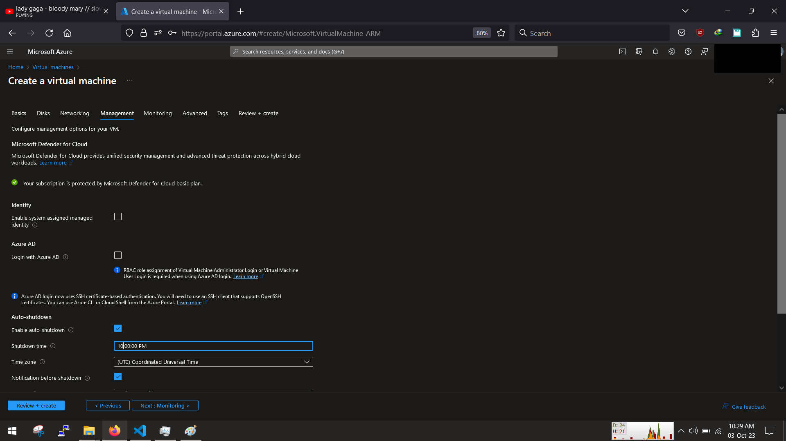

<!-- @format -->

# 0 Set up Infrastructure

In this spirit of an azure cloud engineer we will be setting up all our infrastructure on azure cloud

So without wasting anymore Sign in to the azure portal and create a VM

Search for virtual machines and click create

Select Azure Virtual machine

Fill in all the details as required,

**NB.All resources including network,storage will be created as we go along the creation of the vm**

i used an ubuntu OS with 2gb ram (more than enough to test and push to acr),set the username and password, leave the inbound port as 22, next disk

for disk/storage leave everything as default, dont need much

same applies for networking the basics are fine, a default vpc and subnet will br created for you

As for management set the shutdown time to be 10pm incase you sleep and forget the vm, leave the rest a default

For monitoring, disable the boot diagnostics, we dont need that again leave the rest as default

if you noticed i skipped advanced, nothing to do there, except maybe you want something to be intialised as soon as the vm is up, other than that go straight and tag your resources

Review your configuration and then click create

wait for it to create and then go to the resource

Great we have a fresh clean ubuntu vm to use and push to docker

