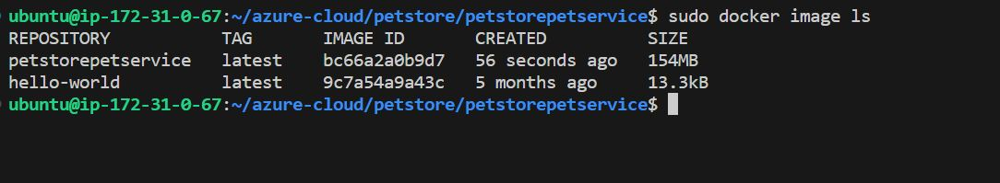

<!-- @format -->

# 1 Build the Images

Test locally, ensure the web app is working...before we push to acr, Use docker to build the images and push to acr

Make sure you have docker installed check it using `--version` flag

```
:~$ docker --version
```

For us to test, we will create a docker network and then run the images using the same network. so create the network first

```
:~$ docker network create petstorebridge
```

we can now start building our images.

for simplicity sake,navigate into each folerand repeat this 5 times, same steps apply to all images, just change the name,port,url etc etc

for example, navigate into the directory and build the images cd into /petstore/petstoreservice then build using the build command `docker build -t <imagename> .`

```
:~$ docker build -t petstorepetservice .
```


When its done, we can use `docker image ls` commnad and check the image

```
:~$ docker image ls
```



then we can run it so that we can test and see it locally

Normally it will just be `docker run -d -p <port>:<port> imagename:tag` but because we are using a network and some other enviroment varialbe it will be come this

```
:~$ docker run --rm --net petstorebridge --name petstorepetservice -p 8081:8081 -e PETSTOREPETSERVICE_SERVER_PORT=8081 -d petstorepetservice:latest
```

Open a browser and head to `http://localhost:8081`


Congratulations is working, now repeat same steps for others the last one will be slightly diffrent
