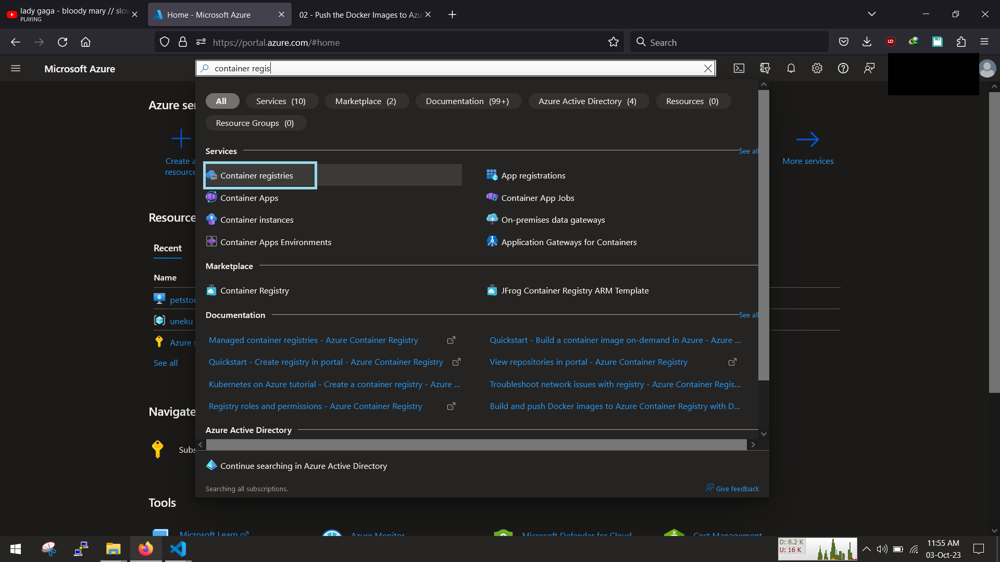
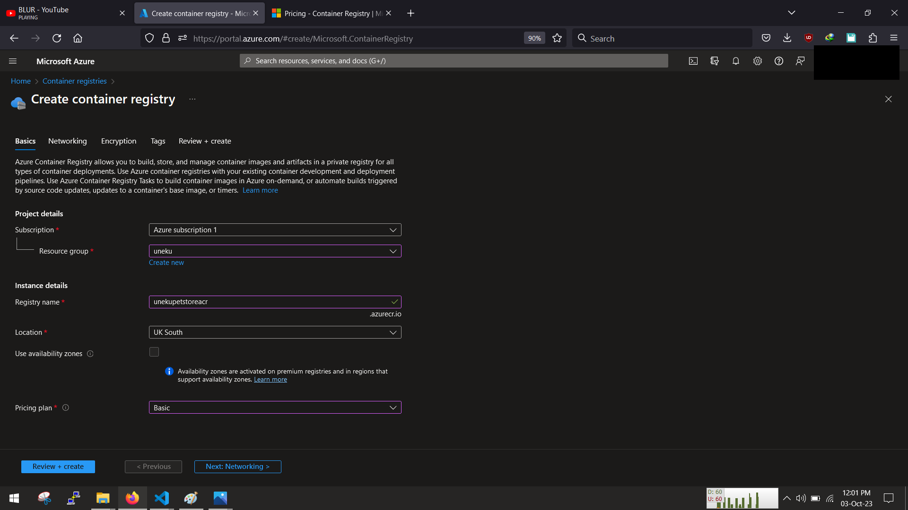
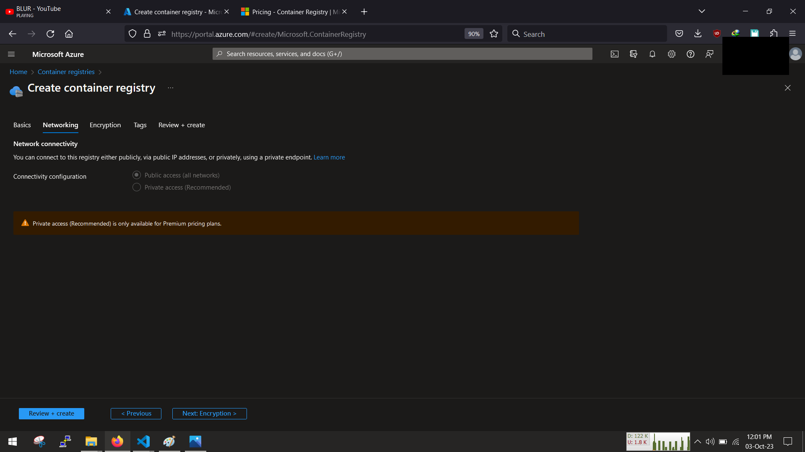
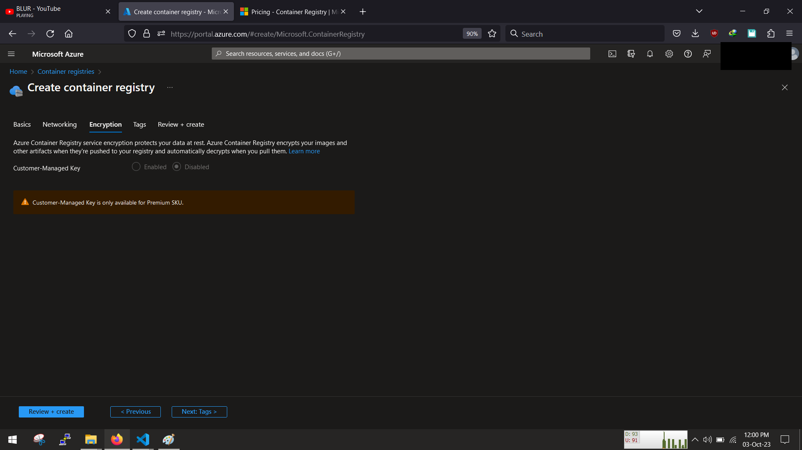
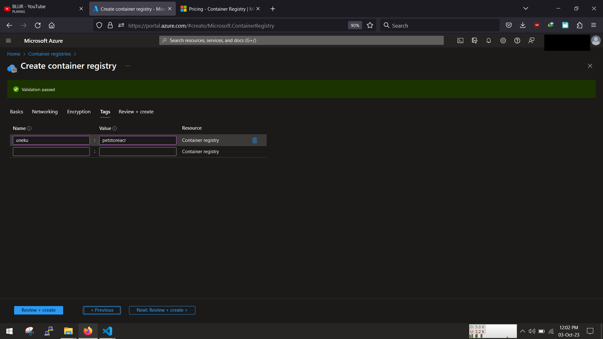
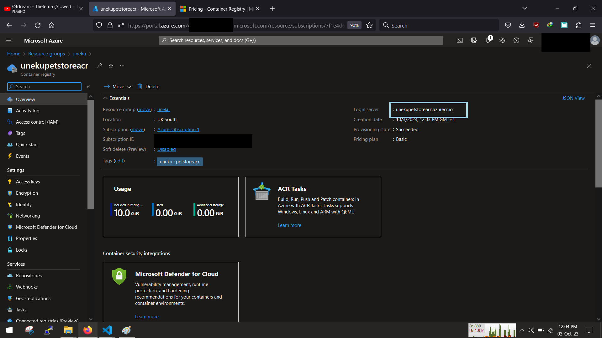
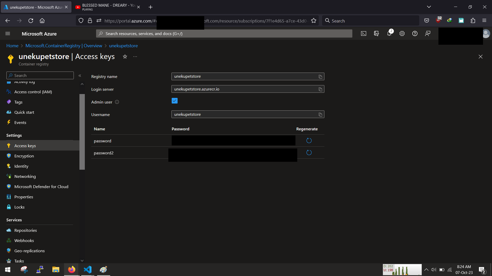
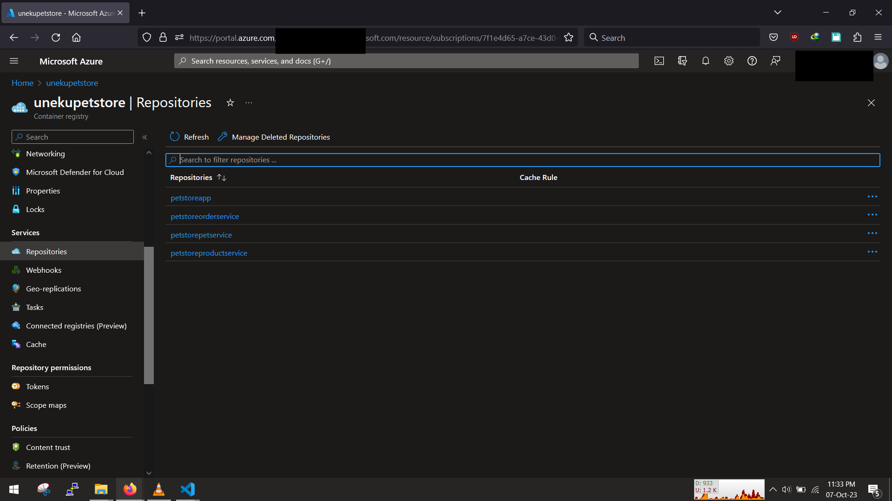

<!-- @format -->

# 1 Push to Acr

Azure Container Registry Acr, think of it as a private docker hub repository but on azure..

Heres the plan

- Create acr
- Login to acr
- Push to acr

# A. Create acr

Sign in to the portal, search for container registry and create



fill in the details and remember the Acr login url, that what we are going to use and login to our private container registry



the rest can be left as default, so we can quickly go through them

for networking leave as default



same encyryption



tag your resource and then click "Review + Create"



once done, it shoud look like this



# B. Login to Acr

Before we push to acr we need to ensure we are signed into our azure account in the terminal,

Download the azure cli from the [official](https://learn.microsoft.com/en-us/cli/azure/install-azure-cli) Azure cli page and test its working by using the `--version` flag

```
:~$ az --version
```

it should return the version details, once you see that it means we are good

Login to your azure account and set te subscription using `az login` follow the prompt

```
:~$ az login
```

Once it returns a json of your account details, it good

next we need to sign in to Acr, before we do that, go to the acr console in azure and grab your acr username and key



Procced back to your terminal and then login with the command `az acr login -n registryName`

```
:~$ az acr login -n unekupetstore
```

once logged in succesfully we can begin to push to acr

# C. Push to acr

Once the images are ready we can push to acr, so first tag the image with

```
docker image tag <petstoreorderervice>:latest <youraliaspetstorecr>.azurecr.io/petstoreorderservice:latest
```

then finally push them to acr

```
docker push <youraliaspetstorecr>.azurecr.io/petstoreapp:latest
```

go to acr under repo, you should see your images


